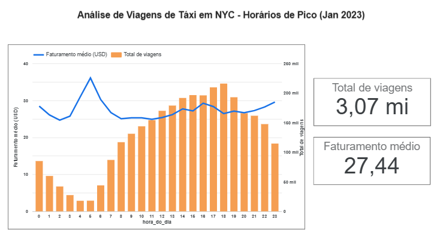

# 📊 Análise de Viagens de Táxi NYC 2023 - Arquitetura de Dados em GCP

---

## 🔗 Dashboard Interativo (Looker Studio)

**Acesse a Análise Completa e Interativa:** https://lookerstudio.google.com/reporting/74afcd7b-4122-48ba-990a-9458e1580ab5/page/sYIgF?s=rBbHV6MBUTk

---

## 1. Visão Geral do Projeto

Este projeto demonstra a criação de um pipeline de dados analíticos completo (End-to-End) na nuvem utilizando serviços do Google Cloud Platform (GCP).

* **Sobre:** Análise exploratória de milhões de registros de viagens de táxi amarelo de Nova York (dataset de Janeiro/2023).
* **O Objetivo:** Demonstrar proficiência em arquitetura de dados moderna (ELT) e extrair *insights* acionáveis sobre padrões de viagem e tarifação.

---

## 2. Arquitetura e Fluxo de Dados (ELT)

O pipeline segue um padrão de **Extract, Load, Transform (ELT)**, desacoplando o armazenamento do processamento para otimizar custos e performance.

1.  **Extract & Load (E/L):** O dataset original no formato **Parquet** é armazenado no **Cloud Storage (GCS)**, que atua como o **Data Lake/Staging Area** do projeto. O formato Parquet foi escolhido para otimizar a leitura colunar e reduzir o volume de dados processados.
2.  **Load (L):** Os dados são carregados do GCS para o **BigQuery**, o Data Warehouse do GCP, onde são armazenados e ficam prontos para consulta.
3.  **Transform (T):** A transformação (agregação, cálculos, etc.) é realizada **dentro** do BigQuery usando consultas SQL (Passo 3).
4.  **Visualização:** O BigQuery é conectado diretamente ao **Looker Studio** para a criação de um dashboard interativo (Passo 4).

### ⚙️ Configuração Inicial

* **Projeto GCP:** Criado um projeto isolado (`portfolio-taxi-nyc-...`) com as APIs de **Cloud Storage** e **BigQuery** habilitadas, seguindo a melhor prática de modularidade e controle de recursos.
* **Ingestão de Dados:** O arquivo `yellow_tripdata_2023-01.parquet` foi carregado para o bucket do GCS e, subsequentemente, para o dataset `nyc_taxi_data` no BigQuery.

---

## 🏛️ Análise e Estimativa de Custos (FinOps)

Um aspecto crucial em projetos de nuvem é a gestão de custos. Embora este projeto tenha um custo efetivo de **$0.00** por se enquadrar no **Nível Gratuito (Free Tier) do Google Cloud**, a análise abaixo detalha como os custos seriam calculados em um cenário real.

A arquitetura do projeto (`GCS -> BigQuery -> Looker Studio`) foi desenhada para ser extremamente eficiente em custos.

| Serviço | Componente de Custo | Uso no Projeto | Estimativa de Custo Mensal |
| :--- | :--- | :--- | :--- |
| **Cloud Storage (GCS)** | Armazenamento | ~50 MB (0.05 GB) para o arquivo `.parquet` | $0.00 (Nível gratuito inclui 5 GB/mês) |
| | Operações (Classe A/B) | ~10-20 operações (upload, leitura pelo BQ) | $0.00 (Nível gratuito inclui milhares de operações)|
| **BigQuery** | Armazenamento (Storage) | ~50 MB de dados na tabela | $0.00 (Nível gratuito inclui 10 GB/mês) |
| | Processamento (Análise) | ~200-300 MB processados em todas as queries | $0.00 (Nível gratuito inclui 1 TB/mês) |
| **Looker Studio** | Visualização | 1 Dashboard conectado via BigQuery | $0.00 (O Looker Studio é gratuito) |
| **Custo Total Estimado** | | | **~$0.00** |

#### **Conclusão da Análise**

O custo para a ingestão, armazenamento, análise e visualização dos dados deste projeto é efetivamente nulo, graças ao generoso Nível Gratuito do GCP. Mesmo que o volume de dados aumentasse 100 vezes (para 5 GB), o custo ainda permaneceria próximo de zero.

Para validar estas estimativas, foi utilizada a **Calculadora de Preços do Google Cloud**. O uso de ferramentas oficiais para o planejamento e previsão de custos validam a arquitetura do projeto como uma solução altamente escalável e de baixo custo para *pipelines* de dados analíticos.

---

## 3. Resultados-Chave (Análise e Insights de Negócio)

Os resultados da análise em BigQuery SQL foram agregados para responder a perguntas críticas de negócio, focando em alocação de recursos e estratégia de precificação:

* **Distribuição de Mercado:** O **VendorID 2 domina o volume de viagens**, capturando uma parcela significativamente maior do mercado em relação ao VendorID 1. Essa métrica é essencial para entender a competitividade e o alcance da frota.
* **Horários de Pico e Preço:** A **hora de pico de viagens é consistentemente às 18h**, com o faturamento médio por viagem se mantendo alto. Isso sugere uma oportunidade clara para implementar precificação dinâmica (*surge pricing*) durante o final da tarde para maximizar a receita.
* **Rotas:** A Consulta 3 identificou os 10 pares de zonas de embarque e desembarque mais frequentes. Esses dados são úteis para **planejamento de marketing e garantia de disponibilidade** de motoristas em áreas de alta demanda.
* **Tendência Financeira (Avançada):** A Média Móvel de 7 dias (calculada via Window Functions) demonstra uma **tendência de faturamento diário estável**. Esta técnica suaviza as quedas naturais dos fins de semana, fornecendo uma base mais confiável para previsões financeiras e de longo prazo.

---

## 4. Detalhes Técnicos e Código SQL

Toda a lógica de extração de *insights* e as queries SQL complexas utilizadas no BigQuery estão disponíveis para revisão.

* O arquivo **`queries.sql`** neste repositório contém o código completo e comentado das quatro consultas, incluindo o uso de **Common Table Expressions (CTEs)** e **Window Functions**.

---

## 5. Visualização e Eficiência (Dashboard Final)

A visualização foi entregue através do Looker Studio, transformando os *insights* do BigQuery em um dashboard claro e interativo.

### 🧠 Justificativa de Engenharia: Eficiência da Consulta

O Looker Studio **não foi conectado diretamente à tabela de dados bruta**. Em vez disso, foi conectada a uma **Consulta Personalizada (pré-agregada)** (a Consulta 2 do arquivo `queries.sql`).

* **Benefício:** Esta decisão garante que o Looker Studio só leia as **24 linhas** resultantes da agregação (uma para cada hora do dia), minimizando o processamento de milhões de linhas, **reduzindo o custo de query no BigQuery** e tornando o dashboard praticamente instantâneo.

### 🖼️ Dashboard de Horários de Pico

